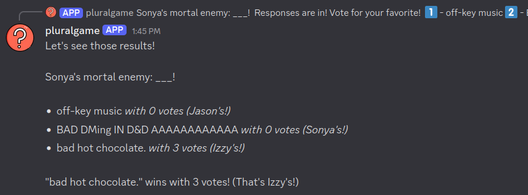

# pluralgame

Discord game bot made specifically so multiple players can participate per Discord account.

# Usage

In order to start a game, run `/start` in a channel. Only one game can be open per channel.
The account which opened the game is in charge of cueing game prompts with:
- `/prompt madlibs`
- `/prompt bonmots`
- `/prompt mostlikely`
- `/prompt truthorlie`

To join an open game, use `/add` and input a player name and an emoji for that player to be identified as. Players can join or leave a game at any time.

Currently, there are four game modes: **Most Likely, BonMots, MadLibs,** and **Truth or Lie.**

## Game Modes

### Most Likely
The bot will show a prompt like 'Who is most likely to fall for an internet scam?'
Players then vote for who they think fits the prompt best by reacting to the message.

### BonMots
Think Cards Against Humanity, except free-response. The bot will show a prompt, and players will submit responses.
Players then vote for which response they think is the best by reacting to the message.

### MadLibs
Similar to BonMots, except about the players themselves! Prompts like "What is [player] doing at 4AM?"
Players again vote for which response they think is the best by reacting to the message.

### Truth or Lie
Two truths and a lie! Players submit responses, then the bot queues them up and players vote for which they think is
the lie by reacting to the messages.

###

If you run into issues, please contact @neartsua on discord and/or [join the support server](https://discord.gg/u3zB6z4bkC).